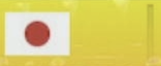

# KartVision

マリオカート 8 デラックス のリザルト画面を、
Google Cloud Vision API を用いて自動で OCR(文字認識)＆即時集計するツールです。

## 主な特徴

- 対戦形式: 2v2 / 3v3 / 4v4 / 6v6 に対応
- ゲーム画面上にある 日本国旗アイコン を自動検知し、リザルト画面が映ったタイミングでスクリーンショット
- 画像前処理 & OCR (Vision API) により、名前 + 得点を即座に読み取り
- 前タグ・後タグ の両方を検出して、チームを自動分け
- スクリーンショット履歴 を Web インターフェース上で確認
- Web から点数修正・タグ修正・チーム統合 などが可能
- 配信ソフト(OBS など)で、リアルタイムの順位結果を表示可能

## 環境構築

1. **Rye のインストール**
   下記リンクを参考に、Python パッケージ管理ツール[Rye](https://rye.astral.sh/)をインストールしてください。

2. **[KartVision](https://github.com/WANPAN01/KartVision)をクローン**

```
git clone https://github.com/WANPAN-MK/KartVision.git

cd KartVision
```

3. **Google Vision API の有効化 & 認証情報セット**

- [Cloud Vision API](https://cloud.google.com/vision/docs/before-you-begin?hl=ja) を有効にする

- サービスアカウントの JSON キーを作成

- その JSON ファイルへのパスを
  `GOOGLE_APPLICATION_CREDENTIALS` 環境変数に設定

4. **依存関係のインストール**
   KartVision ディレクトリ内で

```
rye sync
```

を実行し、必要なパッケージをインストールします。

- 必要なライブラリ (Flask, PyAutoGUI, google-cloud-vision 等) が自動で導入されます。

## 画面範囲 (REGION) の設定

1. ゲーム画面(リザルト)を全画面表示する

2. `region_setup.py`を実行する

```
python3 region_setup.py
```

3. すると `config.json` に `"REGION": [left, top, right, bottom]` が保存されます。

- 画面左上にしたい箇所でマウスを止め、Ctrl + C → 座標確定
- 画面右下にしたい箇所でも同様にマウスを止めて Ctrl + C → 座標確定

下図のようなイメージで、リザルト画面全体を囲むようにカーソルを移動してください。


## アプリケーションの起動

1. Flask サーバーが起動

```
rye run kart
```

コンソール上で、

```
対戦形式はどれですか？2v2:2, 3v3:3, 4v4:4, 6v6:6 ->
```

と聞かれるので、半角数字で入力 (例: 2)

2. 起動に成功すると

```
 * Running on http://127.0.0.1:8888
```

のように表示されます。

3. ブラウザで `http://127.0.0.1:8888` にアクセス

- メイン画面から、/result (結果), /history (履歴), /edit (編集) へ移動できます。

## ブラウザの使い方

- **結果:**
  http://127.0.0.1:8888/result で現在のチームごとの合計点を表示。
  配信ソフト (OBS など) のブラウザソースとして使えば、リアルタイムでスコアを表示可能。
- **履歴:**
  http://127.0.0.1:8888/history で過去のスクリーンショットを、日ごと に閲覧できます。
- **編集:**
  http://127.0.0.1:8888/edit で、もしタグの誤認や点数の修正が必要な場合、Web から編集できるようになっています。

# Q & A

### Q1. スクリーンショットが撮られない

KartVision は、リザルト画面内の日本国旗(下図)を検出してスクリーンショットを撮ります。



- モニターや解像度によって、上記画像と微妙に違うデザインの場合、 `flag_trigger.png` を置き換えてください。
  `src/kartvision/static/images/flag_trigger.png` をご自身で撮ったフラグ画像に差し替えると検出率が上がる場合があります。

### Q2.「Flag の誤検知が発生しました」と出る

- OCR 処理で 12 人分の情報を得られなかった場合に出ます
- `region_setup.py` で設定した `REGION` がずれていて、リザルトが途中で切れている恐れがあります
- `src/kartvision/static/cashe/combined_image.png` や `preprocess.png` を直接開き、文字がちゃんと写っているかご確認ください

以上でセットアップが完了すれば、Mario Kart 8 Deluxe の集計を自動化できます。

不具合・質問があれば Discode、[X](https://x.com/Onepan0519) の DM でお知らせください。

Discode のユーザー名: one\_\_punch
